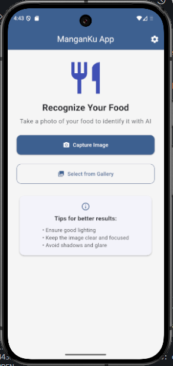
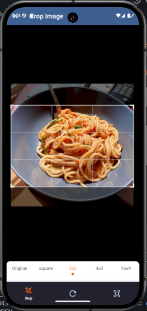
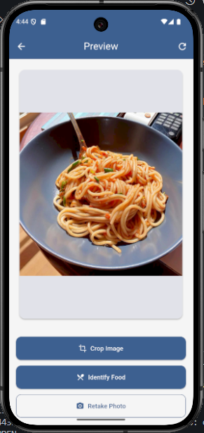
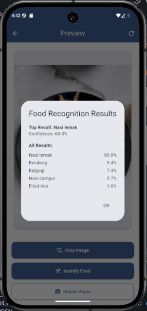
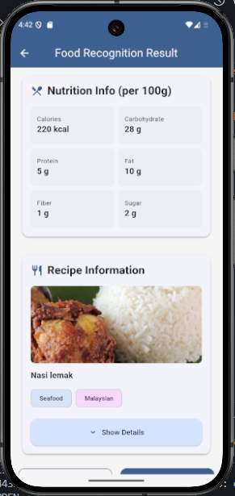

# 🍽️ ManganKu App - AI-Powered Food Recognition

<div align="center">

**ManganKu** is an intelligent food recognition mobile application that uses machine learning to identify food items from photos and provides comprehensive nutritional information, recipes, and cooking instructions.

[](https://flutter.dev)
[](https://firebase.google.com)
[](https://www.tensorflow.org/lite)
[](https://ai.google.dev)

[📱 Download APK](https://github.com/FadhilAlif/manganku_app/releases/latest) • [📸 View Screenshots](#-screenshots) • [🐛 Report Bug](https://github.com/FadhilAlif/manganku_app/issues) • [💡 Request Feature](https://github.com/FadhilAlif/manganku_app/issues)

</div>

---

## 📱 About ManganKu App

ManganKu is a cutting-edge mobile application that combines the power of artificial intelligence with food recognition technology. Simply take a photo of any food item, and our AI will identify it, providing you with detailed nutritional information, recipes, and cooking instructions from trusted sources.

### 🎯 Key Features

- 🔍 **AI-Powered Food Recognition**: Advanced machine learning model to identify food items with high accuracy
- 📸 **Smart Camera Integration**: Take photos or select from gallery with built-in cropping functionality
- 🥗 **Comprehensive Nutrition Info**: Detailed nutritional breakdown including calories, carbs, protein, fat, fiber, and sugar
- 📚 **Recipe Database**: Access to thousands of recipes from MealDB with ingredients and cooking instructions
- 🎥 **Video Tutorials**: Direct links to YouTube cooking tutorials
- 🌙 **Modern UI/UX**: Clean, intuitive interface with skeleton loading and smooth animations
- 🔧 **Customizable Settings**: Configure API keys and app preferences
- 🚀 **Real-time Processing**: Fast inference with Firebase ML cloud models

---

## 🚀 Quick Start

### For Users

1. **Download & Install**

   - Download the latest APK from the [Releases](https://github.com/FadhilAlif/manganku_app/releases/latest) page
   - Install on your Android device (iOS version coming soon)

2. **Setup API Keys**

   - Open the app and go to Settings
   - Add your Gemini AI API Key for nutrition information
   - API keys are stored securely on your device

2. **Start Using**
   - Tap "Take Photo" to capture food images
   - Or use "Select from Gallery" to choose existing photos
   - Crop the image to focus on the food
   - View AI analysis results with nutrition info and recipes

### For Developers

```bash
# Clone the repository
git clone https://github.com/FadhilAlif/manganku_app.git
cd manganku_app

# Install dependencies
flutter pub get

# Configure Firebase (optional)
# Place your google-services.json in android/app/
# Update firebase_options.dart with your config

# Run the app
flutter run
```

---

## 🛠️ Technical Stack

### Core Technologies

- **Flutter Framework**: Cross-platform mobile development
- **Dart Language**: Primary programming language
- **Firebase**: Backend services and ML model hosting
- **TensorFlow Lite**: On-device machine learning inference

### AI & Machine Learning

- **Firebase ML**: Cloud-based model hosting and distribution
- **TensorFlow Lite**: Food classification model
- **Google Gemini AI**: Nutritional information generation
- **Custom Food Recognition Model**: Trained for accurate food identification

### APIs & Services

- **MealDB API**: Recipe and cooking instruction database
- **Google Gemini API**: AI-powered nutrition analysis
- **YouTube API**: Video tutorial integration
- **Firebase Storage**: Model and asset hosting

### Key Dependencies

```yaml
dependencies:
  # Core Flutter
  flutter:
    sdk: flutter

  # UI & Navigation
  go_router: ^14.6.2
  skeletonizer: ^2.1.0+1

  # Image Processing
  camera: ^0.11.2
  image_picker: ^1.2.0
  image_cropper: ^9.1.0

  # Machine Learning
  tflite_flutter: ^0.11.0
  firebase_ml_model_downloader: ^0.4.0

  # Networking & APIs
  dio: ^5.9.0
  url_launcher: ^6.2.6

  # Storage & Permissions
  shared_preferences: ^2.5.3
  permission_handler: ^12.0.1
```

---

## 🏗️ Project Architecture

### Folder Structure

```
lib/
├── core/                   # Core utilities and shared components
│   ├── models/            # Data models
│   ├── services/          # Business logic and API services
│   ├── theme/             # App theming
│   ├── utils/             # Utility functions
│   └── widgets/           # Reusable UI components
├── features/              # Feature-based modules
│   ├── home/             # Home screen functionality
│   ├── preview/          # Image preview and cropping
│   ├── result/           # AI analysis results display
│   ├── settings/         # App configuration
│   └── debug/            # Development utilities
└── routes/               # Navigation configuration
```

### Architecture Patterns

- **Clean Architecture**: Separation of concerns with clear layers
- **Feature-First Organization**: Modular code structure
- **Service Layer Pattern**: Centralized business logic
- **Repository Pattern**: Data access abstraction

---

## 🔧 Configuration

### Firebase Setup

1. Create a new Firebase project at [Firebase Console](https://console.firebase.google.com)
2. Enable Firebase ML and Storage services
3. Download `google-services.json` for Android
4. Place the file in `android/app/google-services.json`
5. Update `lib/firebase_options.dart` with your configuration

### API Keys Configuration

The app requires a Gemini AI API key for nutrition information:

1. Get your API key from [Google AI Studio](https://makersuite.google.com/app/apikey)
2. Open the app and navigate to Settings
3. Enter your API key in the designated field
4. The key is securely stored locally on your device

### Model Upload (For Developers)

To upload your custom food recognition model to Firebase ML:
[text](https://www.kaggle.com/models/google/aiy/tfLite/vision-classifier-food-v1)

```bash
# Install Firebase CLI
npm install -g firebase-tools

# Login to Firebase
firebase login

# Deploy your model
firebase deploy --only ml
```

---

## 📸 Screenshots

<div align="center">

|          Home Screen          |          Camera Capture           |            Image Preview            |
| :---------------------------: | :-------------------------------: | :---------------------------------: |
|  |  |  |

|              AI Analysis              |             Nutrition Info              |          Recipe Details           |
| :-----------------------------------: | :-------------------------------------: | :-------------------------------: |
|  |  |  |

</div>

---

## 🚦 Getting Started for Developers

### Prerequisites

- **Flutter SDK**: 3.9.2 or higher
- **Dart SDK**: 3.9.2 or higher
- **Android Studio** or **VS Code** with Flutter extension
- **Firebase Account** (for ML features)
- **Gemini AI API Key** (for nutrition features)

### Development Setup

1. **Clone & Install**

   ```bash
   git clone https://github.com/FadhilAlif/manganku_app.git
   cd manganku_app
   flutter pub get
   ```

2. **Firebase Configuration**

   ```bash
   # Place your google-services.json in android/app/
   # Update lib/firebase_options.dart
   ```

3. **Run in Development Mode**

   ```bash
   flutter run --debug
   ```

4. **Build for Production**
   ```bash
   flutter build apk --release
   flutter build appbundle --release
   ```

### Code Standards

- Follow [Effective Dart](https://dart.dev/guides/language/effective-dart) guidelines
- Use meaningful variable and function names
- Add comments for complex logic
- Write tests for critical functionality
- Use proper error handling with try-catch blocks

---

## 🧪 Testing

### Running Tests

```bash
# Run all tests
flutter test

# Run specific test file
flutter test test/services/image_service_test.dart

# Run tests with coverage
flutter test --coverage
```

### Test Coverage

- **Unit Tests**: Core business logic and services
- **Widget Tests**: UI components and user interactions
- **Integration Tests**: End-to-end user workflows

---

## 🔍 API Documentation

### Firebase ML Service

```dart
// Initialize the service
await FirebaseMLService().initialize();

// Download/update model
final model = await FirebaseMLService().downloadModel();

// Analyze image
final result = await FirebaseMLService().analyzeImage(imageFile);
```

### Gemini AI Service

```dart
// Get nutrition information
final nutrition = await GeminiService.instance.getNutritionInfo('Pizza');

// Returns structured nutrition data
Nutrition nutrition = Nutrition.fromJson(nutritionData);
```

### MealDB Service

```dart
// Search for recipes
final recipe = await MealDbService.instance.searchByName('Pasta');

// Access recipe data
String instructions = recipe['strInstructions'];
String thumbnail = recipe['strMealThumb'];
```

---

## 🐛 Troubleshooting

### Common Issues

**1. Camera Permission Denied**

```
Solution: Enable camera permissions in device settings
Location: Settings > Apps > ManganKu > Permissions > Camera
```

**2. Model Download Fails**

```
Solution: Check internet connection and Firebase configuration
- Verify google-services.json is correctly placed
- Ensure Firebase ML is enabled in console
```

**3. API Key Not Working**

```
Solution: Verify API key configuration
- Check API key is valid in Google AI Studio
- Ensure key has Gemini API access enabled
- Re-enter key in app settings if needed
```

**4. Image Analysis Slow**

```
Solution: Optimize image before analysis
- Crop image to focus on food item
- Ensure good lighting in photos
- Use recommended image size (max 1024x1024)
```

### Debug Mode

Enable debug information in the app:

1. Go to Settings
2. Tap "Debug Info" 7 times
3. Enable detailed logging
4. View logs for troubleshooting

---

## 🤝 Contributing

We welcome contributions! Here's how you can help:

### How to Contribute

1. **Fork** the repository
2. **Create** a feature branch (`git checkout -b feature/AmazingFeature`)
3. **Commit** your changes (`git commit -m 'Add some AmazingFeature'`)
4. **Push** to the branch (`git push origin feature/AmazingFeature`)
5. **Open** a Pull Request

### Contribution Guidelines

- Write clear, concise commit messages
- Add tests for new features
- Update documentation as needed
- Follow the existing code style
- Test your changes thoroughly

### Areas for Contribution

- 🔄 iOS version development
- 🌐 Web version support
- 🔍 Additional food recognition models
- 🌍 Multi-language support
- 📊 Advanced analytics features
- 🎨 UI/UX improvements

---

## 📄 License

This project is licensed under the MIT License - see the [LICENSE](LICENSE) file for details.

```
MIT License

Copyright (c) 2025 Fadhil Alif

Permission is hereby granted, free of charge, to any person obtaining a copy
of this software and associated documentation files (the "Software"), to deal
in the Software without restriction, including without limitation the rights
to use, copy, modify, merge, publish, distribute, sublicense, and/or sell
copies of the Software, and to permit persons to whom the Software is
furnished to do so, subject to the following conditions:

The above copyright notice and this permission notice shall be included in all
copies or substantial portions of the Software.
```

---

## 🙏 Acknowledgments

- **Dicoding Indonesia** - For the learning platform and inspiration
- **Flutter Team** - For the amazing cross-platform framework
- **Firebase Team** - For cloud services and ML capabilities
- **Google AI** - For Gemini AI API and tools
- **MealDB** - For the comprehensive recipe database
- **TensorFlow Team** - For machine learning framework
- **Open Source Community** - For the incredible packages and tools

---

## 📞 Support & Contact

### Get Help

- 📚 [Documentation](README.md)
- 🐛 [Report Issues](issues)
- 💡 [Feature Requests](issues)
- 💬 [Discussions](discussions)

### Connect With Me

- **Developer**: Fadhil Alif
- **Email**: fadhil.alif@example.com
- **LinkedIn**: [linkedin.com/in/fadhil-alif](https://linkedin.com/in/fadhil-alif)
- **GitHub**: [@FadhilAlif](https://github.com/FadhilAlif)

---

<div align="center">

**Made with ❤️ by [Fadhil Alif](https://github.com/FadhilAlif)**

**⭐ Star this repo if you find it helpful!**

</div>
